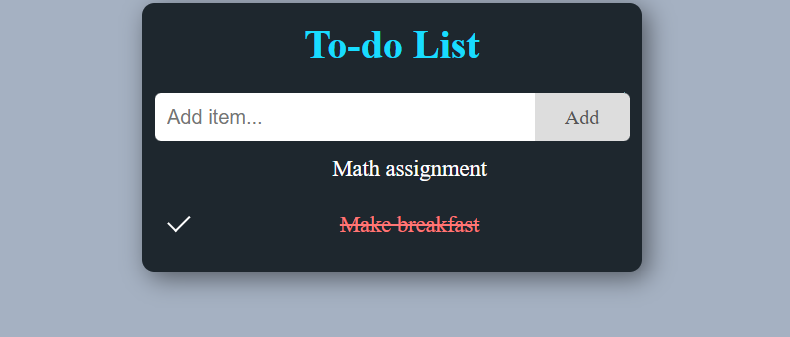

# 📝 To-Do List App

A simple and responsive To-Do List web application built using **HTML**, **CSS**, and **JavaScript**. This app allows users to add, complete, and delete tasks to help manage daily activities efficiently.

## 🔍 Features

- ✅ Add new tasks
- 🗑️ Delete individual tasks
- ☑️ Mark tasks as complete/incomplete

## 📸 Demo


## 🚀 Getting Started

### 1. Clone the Repository

```bash
git clone https://github.com/geokal21/To-do-List.git
cd todo-list-app
